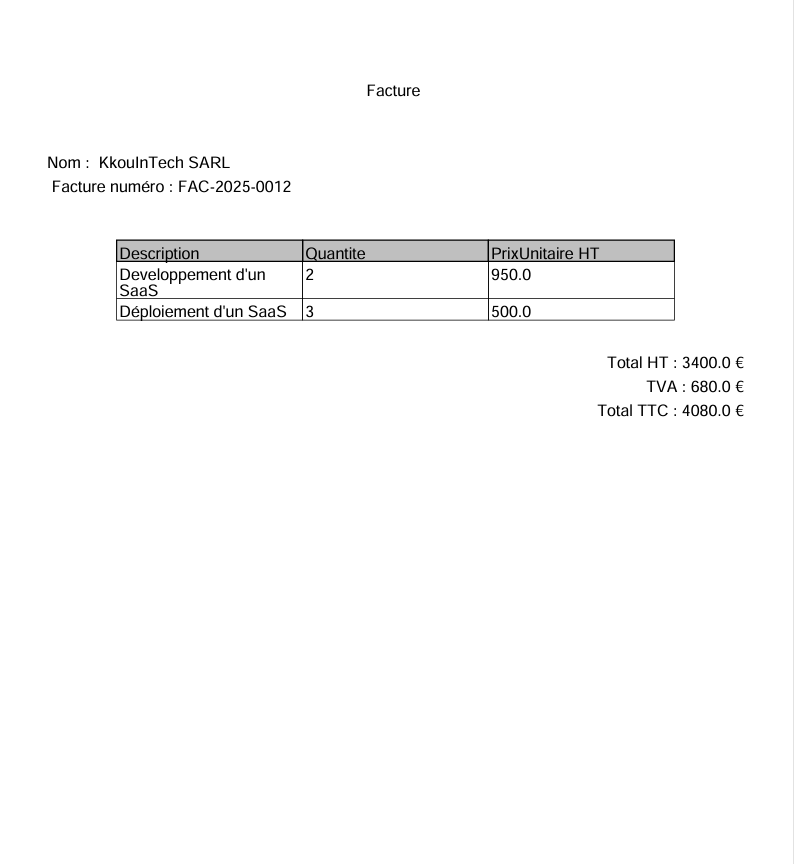

# 🧾 Module de Facturation – Java / Spring Boot

Ce projet est un mini-module de facturation RESTful développé en **Java 17** avec **Spring Boot 3.5.2 Il permet de gérer les clients, d’émettre des factures avec calculs automatiques, et d’exporter les factures au format JSON.

## 🚀 Fonctionnalités principales

### 1. Gestion des Clients
- Création d’un client 
- Liste des clients
- Détail d’un client par son identifiant

### 2. Gestion des Factures
- Création d’une facture 
- Calcul automatique des montants :
  - **Total HT**
  - **Total TVA**
  - **Total TTC**
- Liste des factures

### 3. Règles métier
- Une facture doit comporter **au moins une ligne**
- Aucun champ requis ne peut être vide
- Taux de TVA autorisés : `0%`, `5.5%`, `10%`, `20%`

## 🛠️ Stack technique

- Java 17
- Spring Boot 3.5.2
- Spring Data JPA
- Spring web
- maven
- itexttpdf
- PostgreSQL
- Lombok
- Swagger (OpenAPI)
- JUnit 5

### Lancer l'application

### A faire
- Endpoint pour retourner une facture complète au format JSON structuré
- 🔐 Authentification basique avec Spring Security (in-memory)
- ✅ Tests unitaires sur les services métiers

